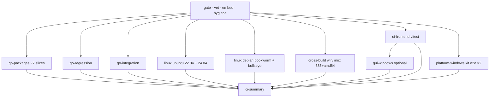

# CI test architecture (GitHub Actions)

Репозиторий **public** — hosted Actions без лимита минут private-tier. На push всё равно **ci-lite** (быстрый feedback).

## Два профиля

| Профиль | Триггер | Runners | ~время |
|---------|---------|---------|--------|
| **lite** | push, PR, dispatch default | 1× ubuntu-22.04 | 15–25 мин |
| **full** | dispatch `profile: full` | gate + 7 slices + 4 OS + 4 cross + 2× Windows + summary | 30–60+ мин |

Запуск full: Actions → **CI** → Run workflow → `profile: full`, опционально `kit_ui_launcher`, `run_wails_build`.

## ci-lite (push / PR)

Один job `ci-lite · ubuntu-22.04`:

- frontend vitest + build + Wails embed check
- `go vet`, `go build ./cmd/muhomor`
- `go test ./internal/...`
- `go test -run Regression ./internal/...`
- cross-build smoke: win/linux × amd64/386
- `scripts/verify-publish-ci.sh`

## full matrix (ручной)



### go-packages (7 slices, Ubuntu 22.04)

| Slice | Packages |
|-------|----------|
| controller-runtime | `controller`, `simplemode` |
| selector-standby-probe | `selector`, `standby`, `probe`, `profileclass` |
| store-aggregate | `store`, `aggregate` |
| config-routing | `configgen`, `routing` |
| subscription-mihomo-apiclient | `subscription`, `mihomo`, `apiclient` |
| ui-model-pseudogui-wails | `ui/model`, `presenter`, `pseudogui`, `wailsapp` |
| paths-systemd | `paths`, `systemd` |

### Другие jobs

| Job | Что проверяет |
|-----|----------------|
| go-regression | `TestRegression_*` — якоря болей (`docs/PAINPOINT_TESTS.md`) |
| go-integration-matrix | `go test -tags=integration` subscription fetch (сеть) |
| platform-linux-ubuntu | build + smoke на 22.04 и 24.04 |
| platform-linux-debian | build + smoke в `debian:bookworm-slim`, `bullseye-slim` |
| cross-build | `GOOS/GOARCH` win/linux 386+amd64 |
| ui-frontend | vitest + build |
| platform-windows | `kit-e2e-smoke.ps1` на windows-2022 и windows-2025 |
| gui-windows | Wails build (только `run_wails_build: true`) |
| ci-summary | таблица в Actions + fail если required job упал |

### Три контура UI (kit-dual-ui-testing)

| Контур | CI job | Локально |
|--------|--------|----------|
| Daemon API | `platform-windows` (`-UILauncher daemon`) | `scripts/kit-e2e-smoke.ps1 -MinimalPack` |
| Wails | unit в `go-packages` ui slice; e2e `-UILauncher gui` | `-start-hidden` |
| Pseudo-GUI | unit в ui slice; e2e = тот же REST (`pseudo`) | `go test ./internal/ui/pseudogui/...` |

## Локальная parity

```powershell
powershell -File scripts/ci-test-matrix.ps1   # Go slices + regression + integration + frontend
go test -count=1 -run Regression ./internal/...
```

Linux/macOS: `bash scripts/ci-test-matrix.sh`

## Платформы на GitHub

| Runner | Роль |
|--------|------|
| ubuntu-22.04, ubuntu-24.04 | основной Linux |
| debian bookworm/bullseye (container) | Debian smoke |
| windows-2022, windows-2025 | kit e2e x64 |

Не тестируем на GH: Win7, Win10-32, macOS, LTSC — только cross-compile из Linux.
