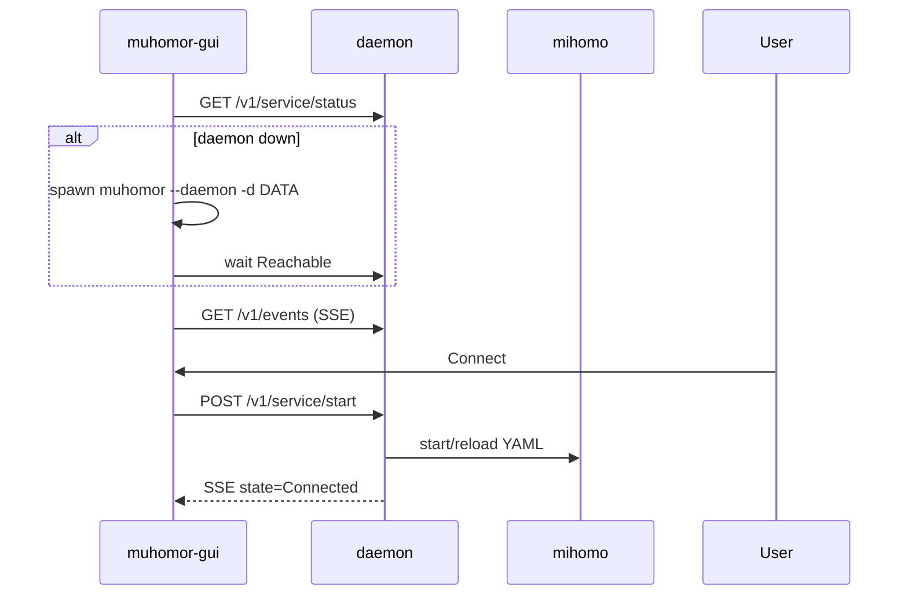

# Phase 4 — Desktop UI: архитектура

**Статус:** проектирование (до реализации)  
**Референс UI:** Dahusim `composeApp` — Simple + Full mode, tray, drawer navigation  
**Репозиторий:** https://github.com/shvshnkr/muhomor

---

## 1. Цели

| Цель | Критерий |
|------|----------|
| Паритет UX Dahusim desktop | Simple connect, tray start/stop, service mode, маршруты, настройки |
| Один Go-стек | Без Compose-desktop shell; Kotlin — только reference |
| Android-ready | UI-слой сменяемый; домен и API стабильны |
| Не ломать CLI/daemon | `muhomor --daemon`, `--ctl`, `--pseudo-gui` остаются |
| Linux first | Tray + окно; Windows вторым этапом; macOS — по возможности Fyne |

**Не в MVP desktop UI:** редакторы всех протоколов (VLESS/Trojan/Hysteria достаточно), Plugin screen, App Manager, полный Dashboard.

---

## 2. Принцип: три процесса, два слоя логики

```
┌─────────────────────────────────────────────────────────────┐
│  muhomor-gui (desktop)     │  muhomor (CLI, optional)      │
│  Fyne window + tray        │  --pseudo-gui, --import-uri    │
└──────────────┬─────────────┴────────────────────────────────┘
               │ HTTP (+ будущий SSE)
               ▼
┌─────────────────────────────────────────────────────────────┐
│  muhomor --daemon                                           │
│  controller.Runtime + store + mihomo subprocess               │
│  единственный владелец TUN/mihomo и SQLite на desktop       │
└─────────────────────────────────────────────────────────────┘
```

**Почему демон обязателен на desktop**

- Один экземпляр mihomo, один TUN, одна SQLite (WAL).
- GUI может упасть/закрыться — VPN/proxy продолжает работать.
- Совпадает с Dahusim: UI ↔ command server ↔ service runtime.
- Android позже: «демон» = foreground `VpnService` + loopback HTTP или binder.

**Почему отдельный бинарь `cmd/muhomor-gui`**

- GUI тянет Fyne/CGO; CLI остаётся лёгким для серверов/скриптов.
- Разные lifecycle: GUI без `--daemon` может **запускать** дочерний демон при старте.

---

## 3. Слои кода (целевая структура)

```
github.com/muhomor/muhomor/
  cmd/
    muhomor/              # CLI + daemon (есть)
    muhomor-gui/          # NEW: только точка входа Fyne

  internal/
    store/                # SQLite (есть)
    controller/           # daemon HTTP + Runtime (есть)
    apiclient/            # HTTP client (есть, расширить)
    appcore/              # домен: use cases (расширить)
      ports.go            # интерфейсы
      service.go          # Connect, Stop, Status, Adapt…
      profiles.go
      settings.go
      events.go           # подписка на статус
    ui/
      model/              # NEW: ViewState, Nav, без Fyne
      presenter/          # NEW: связывает appcore ↔ model
      fyne/               # NEW: виджеты, tray, themes
      console/            # pseudo-gui (есть)
      pseudogui/

  # Android (позже, отдельный модуль/репо):
  # android/app → Kotlin Compose → JNI/localhost → тот же REST
```

### Правила зависимостей

| Пакет | Может импортировать | Нельзя |
|-------|---------------------|--------|
| `appcore` | `apiclient`, `store` (через интерфейсы) | `fyne`, `os/exec` UI |
| `ui/model` | `appcore` типы | `fyne` |
| `ui/fyne` | `ui/model`, `ui/presenter`, `fyne` | прямой `controller` |
| `controller` | всё ядро | `fyne` |

---

## 4. Выбор UI-стека (решение)

| Вариант | Плюсы | Минусы | Вердикт |
|---------|-------|--------|---------|
| **Fyne v2** | Pure Go, Linux/Win/macOS, tray (fyne.io/systray), один бинарь | CGO, не Android | **✅ Desktop Phase 4** |
| Wails | Богатый web UI | WebView, два стека, тяжелее | Отложить |
| Compose Desktop | Паритет с Android UI | Kotlin + Go, два рантайма | Против стратегии full Go |
| GTK/qt binding | Нативно | CGO hell, мало Go-идиом | Нет |

**Итог:** `fyne.io/fyne/v2` + `fyne.io/x/systray` (или встроенный tray Fyne 2.5+). Тема: тёмная по умолчанию, системная опционально.

---

## 5. Расширение Daemon API (обязательно до GUI)

Сейчас GUI/pseudo-GUI читают SQLite напрямую — для Android и второго клиента это плохо. Phase 4.0 = **REST parity** в `controller/daemon.go`:

| Метод | Путь | Назначение |
|-------|------|------------|
| GET | `/v1/service/status` | есть |
| GET | `/v1/events` | **NEW** SSE: state, profile, handoff reason |
| GET/PUT | `/v1/settings` | service_mode, ports, tun, route_quick |
| GET | `/v1/profiles` | список |
| POST | `/v1/profiles/import` | uri или multipart file |
| PUT | `/v1/profiles/{id}/enabled` | вкл/выкл |
| POST | `/v1/profiles/{id}/connect` | connect конкретного профиля (опционально v1) |
| POST | `/v1/service/ping` | url-test через mihomo (замена файлового ping) |

`appcore` переходит на **только** `ServiceControl` + `RemoteConfig` (HTTP), локальный `store` в GUI — удалить.

---

## 6. appcore: use cases (вместо «меню-скриптов»)

```go
// Пример границ — не финальный API
type App struct {
    Daemon  ServiceControl
    Config  ConfigRepository  // remote или embedded для тестов
    Events  EventStream
}

func (a *App) SimpleConnect(ctx context.Context) error
func (a *App) Disconnect(ctx context.Context) error
func (a *App) SetServiceMode(ctx context.Context, mode string) error  // + Reload
func (a *App) SetRouteQuick(ctx context.Context, profile int) error
func (a *App) ImportSubscription(ctx context.Context, r io.Reader) ([]ImportResult, error)
```

**ViewModel (`ui/model`)** держит:

- `ConnectionState` (Idle / Connecting / Connected / Error)
- `ActiveProfile`, `ActivityText` (аналог `SIMPLE_MODE_ACTIVITY`)
- `SettingsSnapshot`
- `Profiles []ProfileRow`

**Presenter** подписывается на `EventStream`, обновляет model, шлёт в Fyne через channel (`fyne.Do`).

---

## 7. Карта экранов (паритет Dahusim)

### 7.1 Simple mode (MVP desktop — Phase 4.1)

Аналог `SimpleHomeScreen`:

| Элемент | Действие |
|---------|----------|
| Большая кнопка Connect/Disconnect | `SimpleConnect` / `Stop` |
| Статус + activity line | SSE + KV `simple_mode_activity` (добавить в API) |
| «Полный режим» | переключение nav → Full |
| Экспорт логов | `ExportLog` + open folder |
| Snackbar ошибки | no profile, no internet, all servers dead |

Без: VPN permission dialog (desktop TUN через polkit/cap_net_admin — отдельный `platform` hook).

### 7.2 Full mode (Phase 4.2+)

Аналог drawer + `NavRoutes`:

| Экран | Приоритет | API / store |
|-------|-----------|-------------|
| Configuration (список профилей/групп) | P1 | profiles, groups |
| Route (quick profile, RU presets) | P1 | settings.route_quick |
| Settings (mixed port, auth, service mode) | P1 | settings |
| Log / export | P2 | export-log |
| About / update | P2 | update-check stub |
| Dashboard, Tools, Plugins, Assets | P3 / never | отложить |

Навигация: боковая панель (Fyne `container.AppTabs` или custom drawer).

### 7.3 System tray (Phase 4.1, с Dahusim)

Аналог `DesktopMain` tray:

- Показать окно
- Start / Stop (enabled по state machine)
- Service mode: Proxy / VPN (radio) → PUT settings + reload
- Выход (stop service + quit GUI, **демон** — опция «оставить демон» как в Dahusim quit window only)

---

## 8. Жизненный цикл GUI



| Политика | Решение |
|----------|---------|
| Single GUI instance | lockfile `{RuntimeDir}/gui.lock` |
| Data dir | тот же `paths.Layout`, флаг `-d` |
| Закрытие окна | свернуть в tray (как Dahusim `onCloseRequest`) |
| Autostart connect | settings `autostart` KV (новый ключ) |

---

## 9. Платформы

| Платформа | Transport | TUN | Tray |
|-----------|-----------|-----|------|
| Linux | Unix socket | `service_mode=vpn`, cap/pkexec TBD | да |
| Windows | TCP :8751 | Wintun через mihomo | да |
| macOS | Unix/TCP | ограничено | Fyne tray |
| Android (позже) | localhost/binder | VpnService | notification |

`internal/platform` (NEW, build tags):

- `daemon_launcher_linux.go` — exec `muhomor --daemon`
- `daemon_launcher_windows.go` — hidden process
- `open_file.go` — xdg-open / explorer для логов

---

## 10. Android-ready (без GUI сейчас)

| Desktop | Android (Phase 5) |
|---------|-------------------|
| `appcore.App` | тот же пакет, `gomobile` или AAR с Go core |
| `apiclient` → Unix/TCP | `127.0.0.1` в VPN process |
| `ui/fyne` | **не собирается** на Android |
| `ui/model` + `presenter` | переиспользуется из JNI или дублируется тонко в Kotlin |
| Fyne tray | Foreground service + notification actions |

**Не делать:** импорт Fyne в `appcore`. **Делать:** стабильный REST + события.

---

## 11. Этапы реализации

| Этап | Содержание | Готово когда |
|------|------------|--------------|
| **4.0** | REST settings/profiles/events; appcore refactor; `apiclient` v2 | ✅ [PHASE4_0.md](PHASE4_0.md) |
| **4.1** | `muhomor-gui`: Simple screen + tray + daemon autostart | Connect/disconnect с tray на Linux |
| **4.2** | Full: Profiles, Route, Settings | Паритет ключевых экранов |
| **4.3** | Windows polish, chain UI, import file dialog | Win10+ tray |
| **4.4** | macOS smoke, упаковка (.deb / MSI) | — |

Оценка: 4.0 — фундамент; без него Fyne-экраны будут дублировать pseudo-gui anti-pattern.

---

## 12. Тестирование

| Уровень | Что |
|---------|-----|
| Unit | `ui/model` state transitions, `appcore` с mock ServiceControl |
| HTTP | `httptest` handlers daemon settings/profiles |
| E2E (Linux CI, manual) | gui start → daemon → connect → status SSE |

---

## 13. Риски

| Риск | Митигация |
|------|-----------|
| Fyne + CGO на CI | docker с gcc; release cross-compile |
| Два писателя SQLite | GUI только через REST |
| TUN права на Linux | док + pkexec helper Phase 4.3 |
| Расхождение с Dahusim expert UI | явный scope MVP в §7 |

---

## 14. Связанные документы

- [PSEUDOGUI.md](PSEUDOGUI.md) — interim TUI
- [PHASE3_1.md](PHASE3_1.md) — inbound/daemon
- Dahusim `MIGRATION_GO_MIHOMO_MAP.md` §8–9
- [adr/001-mihomo-subprocess.md](adr/001-mihomo-subprocess.md)

---

## 15. Резюме решения

1. **Desktop UI = отдельный `muhomor-gui` на Fyne**, общается только с **демоном по HTTP/SSE**.
2. **`appcore` + `ui/model`** — платформенно нейтральное ядро UI-логики.
3. **Сначала REST 4.0**, потом Simple+tray **4.1**, потом Full screens **4.2**.
4. **Android** подключает тот же `appcore`/REST; Fyne не переносится.

Следующий шаг реализации: **Phase 4.0** (daemon API + appcore), затем каркас `cmd/muhomor-gui`.
